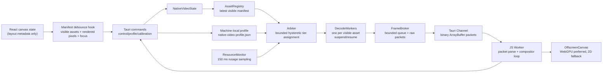

# Native Video Playback Architecture

This document defines the base-case-first native playback stack for Sigma's infinite media canvas. The implementation is intentionally gated: one high-priority stream is allowed before calibration, and multi-stream scaling is enabled only after the local machine profile validates the 4K base case.

## Platform Validation

- Tauri v2 commands remain the control plane. Commands carry manifests, telemetry summaries, and calibration results.
- Tauri v2 channels are the frame plane. Frame payloads are sent as `InvokeResponseBody::Raw(Vec<u8>)`, not JSON.
- Tauri events are not used for frames because they are JSON-oriented and intended for lower-throughput messages.
- The renderer probes `OffscreenCanvas.transferControlToOffscreen()` and starts a dedicated worker before any native manifest is sent.
- The worker probes `navigator.gpu.requestAdapter()` and `OffscreenCanvas.getContext("webgpu")`.
- If WebGPU is unavailable, the worker falls back to an OffscreenCanvas 2D compositor.
- The browser `<video>` path remains the safe presentation path until the native profile is validated or explicitly forced through `localStorage["sigma.nativeVideo.enabled"] = "true"`.
- To run the base-case probe from the app, also set `localStorage["sigma.nativeVideo.calibrate"] = "true"` and keep one source video visible; the first visible video is decoded through FFmpeg into the worker channel.

## Architecture



## Rust Subsystems

### ResourceMonitor

Ownership:
- Runs as a long-lived async task spawned by `NativeVideoState::new`.
- Owns no frame buffers.
- Publishes process-local CPU and RSS telemetry every 150 ms through a watch channel.

Sampling:
- CPU peak core usage is derived from `getrusage()` user+system deltas divided by wall time. A value of `1.0` means one full core.
- RAM is currently process peak RSS from `getrusage()`.
- VRAM is not hard-measured in this subsystem yet; it remains an explicit calibrated/optional assumption.

### AssetRegistry

Ownership:
- The controller owns the latest debounced `CanvasManifest`.
- React sends only visible video assets, rendered pixel occupancy, source dimensions, focus weight, and center weight.

Lifetime:
- Assets absent from the current manifest are removed from the worker set.
- Visible assets receive one worker handle, but that worker may be suspended.

### Arbiter

Ownership:
- Pure allocation logic. It does not decode, allocate frame buffers, or touch IPC.
- Inputs are manifest, profile, telemetry pressure, and previous decisions.

Rules:
- Before base-case validation: maximum active streams is `1`.
- After base-case validation: maximum active streams is `32`.
- Assets are sorted by `priority = focus * 4 + center * 2 + sqrt(visible_area / canvas_area)`.
- Each asset receives the highest fixed tier whose predicted cumulative cost fits the safe budget.
- Upgrade requires explicit headroom and minimum dwell time.
- Downgrade requires sustained budget, queue, or drop pressure, with a shorter dwell to prevent flapping.

### DecodeWorkers

Ownership:
- One async worker exists per visible asset.
- The steady-state visible-asset worker currently uses a synthetic RGBA generator as the packet-producing decode backend scaffold.
- The base-case probe can drive a real source file through FFmpeg rawvideo RGBA by passing `sourcePath` to `native_video_run_base_case_probe`; without `sourcePath`, it uses the synthetic generator.
- The same packet, broker, telemetry, and compositor contracts are used by both probe paths.
- Workers are controlled through `watch::Sender<WorkerAssignment>`.

Lifetime:
- `Active` assignments emit frames at the assigned tier and fps.
- `Suspended` assignments keep the worker alive but stop frame generation.
- Removed assets abort their worker task.

### FrameBroker

Ownership:
- Owns the bounded decoded-frame queue.
- Emits raw binary frame packets through a broadcast channel consumed by Tauri channel subscribers.
- Tracks delivered frames, dropped frames, queue depth, and pressure.

Hard caps:
- Broker input queue: `96` packets.
- Broadcast queue: `32` packets.
- If the queue saturates, decode workers back off and frames are dropped before unbounded growth.

## Binary Frame Packet Format

All integer fields are little-endian. Header length is fixed at 64 bytes.

| Offset | Size | Field |
| --- | ---: | --- |
| 0 | 4 | Magic: `SVF1` |
| 4 | 1 | Version: `1` |
| 5 | 1 | Header length: `64` |
| 6 | 1 | Pixel format: `1 = RGBA8` |
| 7 | 1 | Flags |
| 8 | 8 | Sequence |
| 16 | 8 | PTS microseconds |
| 24 | 8 | Stable FNV-1a stream id |
| 32 | 4 | Decode width |
| 36 | 4 | Decode height |
| 40 | 4 | Stride bytes |
| 44 | 4 | Payload bytes |
| 48 | 2 | Quality tier id |
| 50 | 2 | Reserved |
| 52 | 4 | Layout epoch |
| 56 | 4 | Source width |
| 60 | 4 | Source height |
| 64 | N | RGBA8 payload |

The stream id is `FNV-1a-64(asset.id)`. The worker computes the same id for layout metadata, so frame packets never need JSON metadata alongside pixels.

## Frontend Compositor Loop

React responsibilities:
- Maintain editor state.
- Debounce and send visible-asset manifests.
- Transfer Tauri channel `ArrayBuffer` packets to the worker.
- Never place frame pixels in React state.

Worker responsibilities:
- Parse `SVF1` packets.
- Keep the latest frame per stream.
- Composite only active allocations.
- Prefer WebGPU:
  - `navigator.gpu.requestAdapter()`
  - `requestDevice()`
  - `canvas.getContext("webgpu")`
  - upload RGBA payloads with `queue.writeTexture()`
  - render textured quads at display resolution
- Fallback to OffscreenCanvas 2D:
  - write payloads into per-stream scratch canvases
  - draw scaled quads into the display canvas
- Post upload/composite/drop/throughput metrics back to Rust.

## Resource Formulas

Safe budget:

```text
B_total = 0.8 * min(B_cpu_decode, B_ipc, B_ram_bw)
```

Tier raw byte rate:

```text
raw_bytes_per_sec = width * height * bytes_per_pixel * fps
```

Predicted tier cost:

```text
tier_cost =
  raw_bytes_per_sec *
  max(1.0, decode_factor + upload_factor + composite_factor)
```

Rendered-pixel cap:

```text
cap_w = rendered_width_px  * 1.15
cap_h = rendered_height_px * 1.15
```

A fixed tier is eligible only if its aspect-preserving tier dimensions fit within `cap_w` and `cap_h`. The cap rejects too-large tiers; it does not invent continuous intermediate decode sizes.

Hysteresis:

```text
downgrade if queue_pressure >= 0.65
          or frame_drop_rate >= 0.03
          or predicted_cost > B_total

upgrade only if headroom >= 0.25
            and queue_pressure <= 0.25
            and current_tier_dwell >= 2000 ms
```

## 32-Stream Target

For equal 32-way tiling on a 3840 x 2160 canvas:
- Typical 8 x 4 tile occupancy is approximately 480 x 540, or 480 x 270 for 16:9 content.
- The rendered-pixel cap rejects 720p, 1080p, and 2160p tiers for those tiles.
- The controller preserves focused and centered tiles first.
- Lowest-priority tiles fall from active tier to thumbnail/suspended before the broker queue can collapse.

The target is 32 source assets, not 32 decoded 4K outputs.

## Validation Plan

Base case must pass before scaling:
- One 3840 x 2160 stream at 60 fps.
- Run `native_video_run_base_case_probe` with a 4K source `sourcePath` when FFmpeg is available; use the synthetic path only to validate IPC/compositor plumbing.
- UI thread remains responsive.
- Worker compositor is active.
- Frame pixels are transported as binary channel payloads.
- P95 upload latency <= 8 ms.
- P95 composite latency <= 8 ms.
- Frame drop rate <= 1%.
- Broker queue pressure remains below 25% after warmup.
- Process peak CPU and RAM are recorded.
- Machine profile is persisted to `native-video-profile.json`.

Multi-stream pass/fail:
- Controller never assigns tiers whose predicted total cost exceeds `B_total`.
- No active decode above rendered-pixel cap.
- Quality decisions dwell long enough to avoid flap.
- Overload causes tier downgrade, then thumbnail, then suspend.
- Broker queue never grows beyond its hard cap.
- The app does not OOM under a 32 visible source-asset manifest.

## Degradation Ladder

1. Hold current tiers during transient jitter.
2. Downgrade lowest-priority active assets one tier.
3. Replace lowest-priority assets with thumbnails.
4. Suspend off-center or tiny assets.
5. Preserve focused/selected/audio-active assets preferentially.
6. Stop native presentation and keep the existing browser video path as the safe fallback.

## Calibrated Versus Hard Limits

Calibrated assumptions:
- CPU decode budget.
- IPC byte throughput.
- Upload/composite latency factors.
- RAM bandwidth budget.
- Base-case validation state.

Hard limits:
- 80% safe-budget multiplier.
- Broker queue capacity of 96 packets.
- Broadcast queue capacity of 32 packets.
- Maximum 1 active stream before base validation.
- Maximum 32 active visible source assets after validation.
- Fixed quality tier list.
- Rendered-pixel cap.

Known implementation gap:
- The always-on visible-asset workers still emit synthetic RGBA frames. The base-case command supports real FFmpeg decode for calibration, but a production decoder backend still needs to replace the steady-state generator while preserving the worker assignment, packet, broker, telemetry, and arbitration contracts above.
